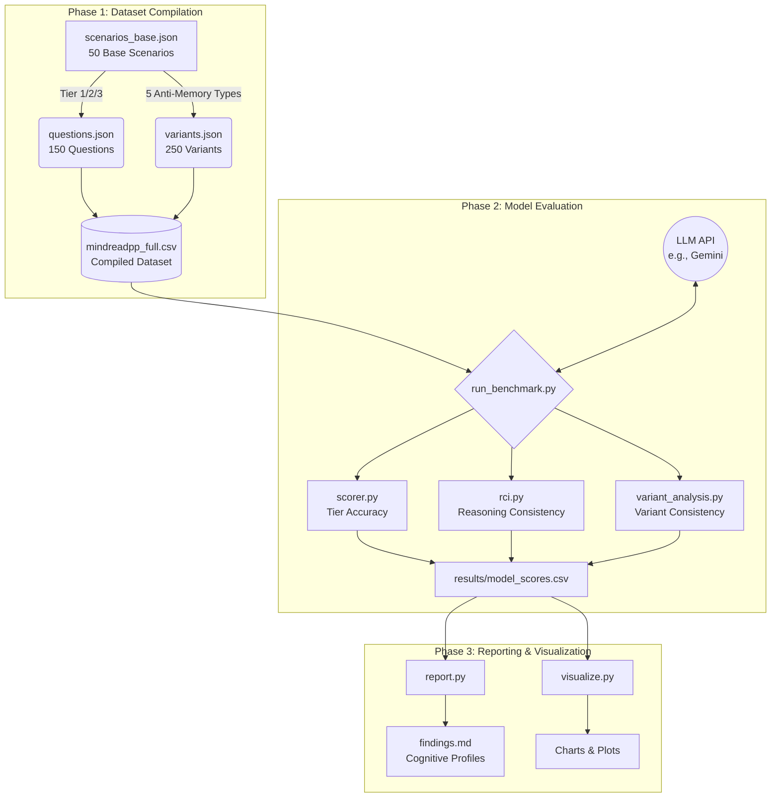

# MindRead++ — Theory of Mind Benchmark for LLMs

> **Competition:** Kaggle · Measuring Progress Toward AGI · Social Cognition Track
> **Track:** Best Overall Benchmark
> **Language:** English

---

## 🧠 What is MindRead++?

MindRead++ is a **multi-tier Theory of Mind (ToM) benchmark** designed to evaluate whether large language models genuinely reason about mental states or merely pattern-match surface cues.

## Run Command
pip install -r requirements.txt
python eval/run_benchmark.py --model gemini-2.0-flash --api-key YOUR_KEY --sample

### Key Features

| Feature | Description |
|---------|-------------|
| **3-Tier Questions** | First-order, second-order, and counterfactual ToM |
| **50 Scenarios** | 3 characters, 2–4 events, clear information asymmetries |
| **Anti-Memorization** | 5 variants per scenario (paraphrase, role-swap, distractor injection) |
| **RCI Metric** | Reasoning Consistency Index — measures if correct answers come from valid reasoning |
| **Composite Scoring** | Weighted score combining accuracy, RCI, and variant consistency |

---

## 🏗️ Architecture & Working Flow

The benchmark operates through three main phases: **Dataset Compilation**, **Model Evaluation**, and **Reporting/Visualization**.



---

## 📁 Repository Structure

```
mindreadpp-benchmark/
├── README.md
├── LICENSE
├── requirements.txt
├── todo.md
├── data/
│   ├── scenarios_base.json    # 50 base vignettes
│   ├── questions.json         # 150 questions (50 × 3 tiers)
│   ├── variants.json          # 250 variants (50 × 5 types)
│   ├── mindreadpp_full.csv    # Flat CSV of everything
│   └── sample_10.json        # 10-scenario sample
├── eval/
│   ├── run_benchmark.py       # Main entry point
│   ├── scorer.py              # Accuracy scoring per tier
│   ├── rci.py                 # Reasoning Consistency Index
│   ├── variant_analysis.py    # Anti-memorization analysis
│   ├── report.py              # Per-model cognitive profile
│   └── visualize.py           # Charts and plots
├── results/
│   ├── model_scores.csv       # Model evaluation results
│   └── findings.md            # Analysis writeup
└── writeup/
    └── writeup_body.md        # Competition submission body
```

---

## 🚀 Quick Start

### 1. Install Dependencies

```bash
pip install -r requirements.txt
```

### 2. Explore the Dataset

```python
import json

# Load 10-scenario sample
with open("data/sample_10.json") as f:
    sample = json.load(f)

print(f"Sample scenarios: {len(sample['scenarios'])}")
print(f"Sample questions: {len(sample['questions'])}")
```

### 3. Run the Benchmark

```bash
# Run on a specific model
python eval/run_benchmark.py --model gemini-2.0-flash --api-key YOUR_KEY

# Run on all models
python eval/run_benchmark.py --all --config config.env

# Use sample dataset for quick test
python eval/run_benchmark.py --model gemini-2.0-flash --sample --api-key YOUR_KEY
```

### 4. Generate Reports

```bash
# Generate cognitive profile
python eval/report.py --input results/model_scores.csv --output results/

# Generate visualizations
python eval/visualize.py --input results/model_scores.csv --output results/charts/
```

---

## 📊 Scoring

### Tier Accuracy
```
Tier_N_Accuracy = correct_at_tier_N / total_at_tier_N
```

### Reasoning Consistency Index (RCI)
```
RCI = correct_with_valid_reasoning / total_correct
```

### Variant Consistency Score (VCS)
```
VCS = 1 - std_dev(accuracy across 5 variants)
```

### Composite Score
```
Composite = 0.20×T1 + 0.30×T2 + 0.30×T3 + 0.10×RCI + 0.10×VCS
```

---

## 🏷️ Scenario Settings

| Setting | Count | Examples |
|---------|-------|----------|
| Domestic / Everyday | 17 | Kitchen, living room, garden |
| Workplace / Professional | 17 | Office, meeting room, lab |
| Social / Public | 16 | Park, café, school, party |

---

## 📝 Citation

If you use MindRead++ in your research, please cite:

```
@misc{mindreadpp2026,
  title={MindRead++: A Multi-Tier Theory of Mind Benchmark with Anti-Memorization Controls},
  year={2026},
  url={https://github.com/YOUR_USERNAME/mindreadpp-benchmark}
}
```

---

## 📄 License

This project is licensed under the MIT License. See [LICENSE](LICENSE) for details.
